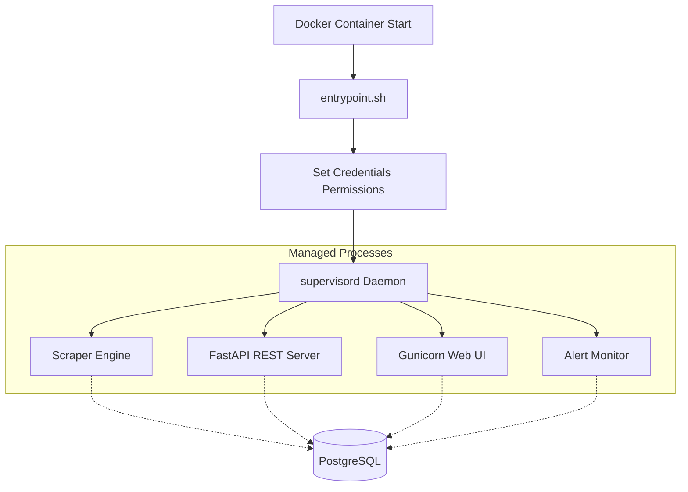
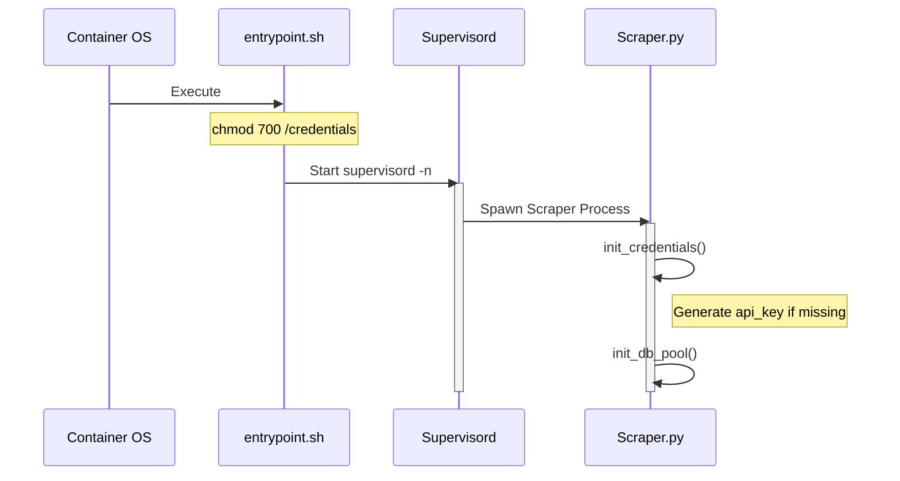

Relevant source files

The following files were used as context for generating this wiki page:

- [supervisord.conf](supervisord.conf)
- [entrypoint.sh](CLAUDE.md) (referenced via CLAUDE.md)
- [README.md](README.md)
- [scraper/scraper.py](scraper/scraper.py)
- [CLAUDE.md](CLAUDE.md)
- [AGENTS.md](AGENTS.md)

# Process Management with Supervisord

Process management in the Web Scraper Platform is handled by **Supervisord**, a system that monitors and controls several long-running processes required for the platform's operation. Within a Docker container environment, Supervisord acts as the primary entry point, ensuring that the scraper engine, REST API, Web UI, and alert systems remain active and automatically restart upon failure.

The system relies on an `entrypoint.sh` script to set secure permissions on the credentials directory before launching the Supervisord daemon. This architecture allows a single Docker container to host multiple decoupled services, maintaining the separation of concerns between data ingestion (scraper), data exposure (API/WebUI), and notification logic (alerts).

Sources: [CLAUDE.md:21-25](CLAUDE.md#L21-L25), [supervisord.conf:1-5](supervisord.conf#L1-L5), [README.md:68-75](README.md#L68-L75)

## Core Service Architecture

The platform is composed of four primary processes managed under a single Supervisord configuration. Each process is configured with specific execution commands, working directories, and logging parameters.

### Managed Processes

| Service | Command | Directory | Purpose |
| :--- | :--- | :--- | :--- |
| **Scraper** | `python /app/scraper/scraper.py` | `/app` | Periodically fetches product data from configured sites. |
| **API** | `uvicorn api:app --host 0.0.0.0 --port 8765` | `/app/api` | Provides a FastAPI-based REST interface for data consumption. |
| **WebUI** | `gunicorn -w 2 -b 0.0.0.0:3000 webui.app:app` | `/app` | Flask-based dashboard for monitoring and configuration. |
| **Alerts** | `python /app/alerts/alerts.py` | `/app` | Monitors price drops and sends Discord notifications. |

Sources: [supervisord.conf:7-39](supervisord.conf#L7-L39), [AGENTS.md:20-25](AGENTS.md#L20-L25)

### Process Flow Diagram

The following diagram illustrates how Supervisord orchestrates the startup and lifecycle of the platform services.

*Note: Supervisord runs in non-daemon mode within the container to keep the container alive while managing sub-processes.*
Sources: [supervisord.conf:2-4](supervisord.conf#L2-L4), [CLAUDE.md:21-25](CLAUDE.md#L21-L25), [scraper/scraper.py:270-275](scraper/scraper.py#L270-L275)

## Supervisord Configuration Logic

The configuration is defined in `supervisord.conf` and utilizes specific directives to ensure production stability.

### Global Configuration
The `[supervisord]` section defines the daemon behavior. It is set to `nodaemon=true` to ensure the Docker container does not exit immediately. Logs are directed to `/dev/null` at the supervisor level because individual process logs are captured separately, and the PID file is stored in `/tmp/supervisord.pid`. All processes run under the `appuser` for security.

Sources: [supervisord.conf:1-6](supervisord.conf#L1-L6)

### Lifecycle and Reliability
Every managed program (scraper, api, webui, alerts) is configured with the following reliability features:
*  **autostart=true**: The process starts automatically when Supervisord launches.
*  **autorestart=true**: If a process crashes or exits unexpectedly, Supervisord immediately attempts to restart it.
*  **Logging**: Standard output (`stdout`) and standard error (`stderr`) for each process are redirected to `/dev/stdout` and `/dev/stderr`. This allows Docker's logging driver to capture all application logs through `docker logs scraper`.

Sources: [supervisord.conf:7-39](supervisord.conf#L7-L39), [CONTRIBUTING.md:12](CONTRIBUTING.md#L12)

## Error Reporting and Context

Because Supervisord runs each process from different working directories, the platform utilizes a shared `github_report.py` script. When an unexpected exception occurs in the API, WebUI, Scraper, or Alerts modules, the `report_error_to_github()` function is called.

If a `GITHUB_ERROR_REPORT_TOKEN` is present, this function:
1.  Redacts secrets, emails, and sensitive paths.
2.  Opens a GitHub issue tagged with `@claude`.
3.  Ensures developers are notified even when processes are running in the background under Supervisord.

Sources: [CLAUDE.md:31-36](CLAUDE.md#L31-L36), [scraper/scraper.py:27-40](scraper/scraper.py#L27-L40)

## Service Initialization and Security

Before Supervisord starts the managed processes, the `entrypoint.sh` script executes a critical security step by setting restrictive permissions on the `/credentials` directory. This ensures that auto-generated secrets like the `db_password` and `api_key` are protected from unauthorized access by other users in the system.

Sources: [CLAUDE.md:21-25](CLAUDE.md#L21-L25), [scraper/scraper.py:164-180](scraper/scraper.py#L164-L180)

## Summary

Supervisord serves as the operational backbone of the Web Scraper Platform, consolidating disparate Python-based services into a single, manageable container unit. By providing automatic restarts and centralized logging to the Docker host, it ensures that the scraping engine and its accompanying interfaces remain resilient to individual component failures. Citing file paths and implementation details, this process management strategy is designed to facilitate production-grade reliability with minimal manual intervention.

Sources: [supervisord.conf:1-39](supervisord.conf#L1-L39), [README.md:36-45](README.md#L36-L45)
