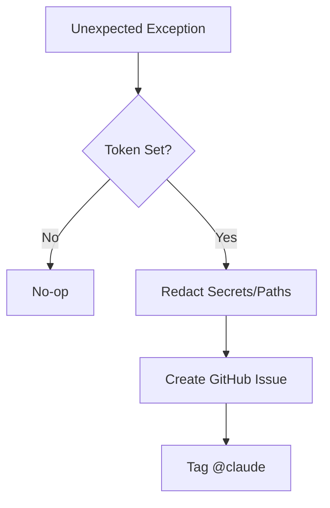

Relevant source files

The following files were used as context for generating this wiki page:

- [AGENTS.md](AGENTS.md)
- [CLAUDE.md](CLAUDE.md)
- [CHANGELOG.md](CHANGELOG.md)
- [scraper/scraper.py](scraper/scraper.py)
- [webui/app.py](webui/app.py)
- [CONTRIBUTING.md](CONTRIBUTING.md)

# AI Agents & Claude Integration

AI Agents and Claude integration within the Scraper platform focus on enabling automated maintenance, error reporting, and external consumption of scraped product data. The system is designed to work with Large Language Models (LLMs) like Claude for both code maintenance and data enrichment, facilitating a "production-ready" environment where AI can assist in scraping logic and issue resolution.

The integration manifests in three primary ways: dedicated agent guidelines for code modification, an automated GitHub error reporting system tagged for Claude, and exposure of database ports and API endpoints for Model Context Protocol (MCP) access and downstream service consumption.

Sources: [CLAUDE.md:1-5](CLAUDE.md#L1-L5), [AGENTS.md:1-5](AGENTS.md#L1-L5), [CHANGELOG.md:104-106](CHANGELOG.md#L104-L106)

## AI Agent Operational Guidelines

The project defines strict boundaries for AI agents (specifically Claude) interacting with the codebase. These guidelines ensure that while agents have the autonomy to improve the scraper, they cannot compromise the security or stability of the main repository branch.

### Agent Permissions
Agents are permitted to perform development tasks such as creating branches, modifying code to fix bugs or add features, running tests, and opening Pull Requests (PRs). However, they are strictly forbidden from pushing directly to the main branch, merging PRs, deleting branches, or modifying secrets and environment variables.

Sources: [AGENTS.md:32-48](AGENTS.md#L32-L48)

### Code Standards for Agents
Agents must adhere to specific technical standards when contributing:
- **Python**: Must follow the PEP 8 style guide.
- **JavaScript**: Must use the provided ESLint configuration.
- **Documentation**: Complex logic and public functions must be documented.
- **Commits**: Clear and descriptive commit messages are required.

Sources: [CONTRIBUTING.md:52-57](CONTRIBUTING.md#L52-L57)

## Claude Error Reporting System

A specialized utility, `report_error_to_github()`, is integrated across the various service modules (API, WebUI, Scraper). This function acts as a best-effort diagnostic tool that automatically opens a GitHub issue when unexpected exceptions occur.

### Automated Issue Generation
When the `GITHUB_ERROR_REPORT_TOKEN` is configured, the system generates an issue tagged with `@claude`. This facilitates rapid triaging by AI agents. The reporter automatically redacts sensitive information such as secrets, emails, and local file paths before submission.

Sources: [CLAUDE.md:30-40](CLAUDE.md#L30-L40)

The diagram shows the logic flow for automated error reporting to GitHub.
Sources: [CLAUDE.md:30-40](CLAUDE.md#L30-L40), [scraper/scraper.py:27-40](scraper/scraper.py#L27-L40)

## Data Consumption and MCP Integration

The platform is architected to expose scraped product data for consumption by external AI services, such as a "product-describer" service. This is supported by REST API endpoints and direct database access.

### External Service Access
- **REST API**: Provides product data via a FastAPI-based REST API.
- **Database Access**: Port 5432 is exposed on localhost specifically to facilitate Model Context Protocol (MCP) access, allowing AI agents to query the PostgreSQL database directly for analysis.
- **Product Enrichment**: The schema includes columns for product descriptions and "why" explanations, which are populated by downstream AI services to provide deeper context than raw scraped data.

Sources: [CHANGELOG.md:104-106](CHANGELOG.md#L104-L106), [CHANGELOG.md:139-141](CHANGELOG.md#L139-L141), [CLAUDE.md:3-5](CLAUDE.md#L3-L5)

### API Authentication and Proxying
The WebUI acts as a control plane, proxying requests to the Scraper Engine and REST API. Authentication is managed via API keys (stored in the `credentials/api_key` file) and internal Engine keys for service-to-service communication.

Sources: [webui/app.py:5-15](webui/app.py#L5-L15), [webui/app.py:73-86](webui/app.py#L73-L86), [scraper/scraper.py:100-110](scraper/scraper.py#L100-L110)

| Component | Port | AI Integration Point |
|-----------|------|----------------------|
| REST API | 8000 | Data consumption for LLM services |
| Web UI | 3000 | Configuration for stealth/AI scraping |
| Postgres | 5432 | Direct MCP access for AI agents |
| Engine API| 5001 | Error reporting via `report_error_to_github` |

Sources: [README.md:54-58](README.md#L54-L58), [scraper/scraper.py:843-845](scraper/scraper.py#L843-L845), [CHANGELOG.md:139-141](CHANGELOG.md#L139-L141)

## Conclusion
The integration of AI agents and Claude within the Scraper platform transitions it from a static tool to an AI-maintained system. By providing clear operational guidelines, automated error reporting, and specific data access points like MCP, the architecture ensures that AI can both maintain the scraper's efficiency and derive meaningful insights from the scraped data.
