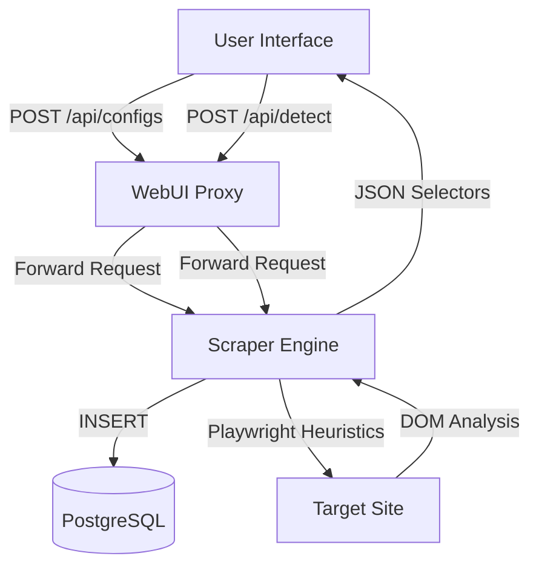
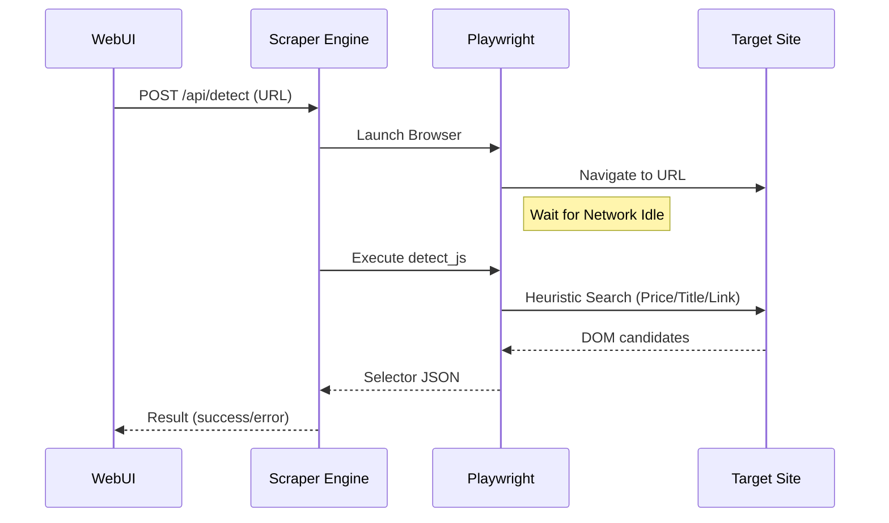

<details>
<summary>Relevant source files</summary>

The following files were used as context for generating this wiki page:

- [webui/templates/config.html](webui/templates/config.html)
- [webui/app.py](webui/app.py)
- [scraper/scraper.py](scraper/scraper.py)
- [webui/static/script.js](webui/static/script.js)
- [README.md](README.md)
</details>

# Adding New Scraper Targets

## Introduction
Adding new scraper targets is the core mechanism for expanding the platform's monitoring capabilities. The system allows users to define new e-commerce sites or specific categories for data extraction by specifying CSS selectors for product containers, titles, prices, and links. This process can be handled manually through the WebUI, automatically via a heuristic detection engine, or rapidly using pre-defined templates for popular Swedish retailers.

The configuration workflow involves defining a `scraper_config` entry, which the background engine then uses to drive Playwright-based headless browser sessions. These sessions navigate to the target URLs, handle cookie consents, and apply the configured selectors to extract product information into the PostgreSQL database.
Sources: [README.md:9-17](README.md#L9-L17), [scraper/scraper.py:205-227](scraper/scraper.py#L205-L227)

## Methods of Adding Targets
Users have three primary ways to add a new site configuration through the WebUI:

### 1. Manual Configuration
Users can manually input the CSS selectors required for the scraper to identify elements on a page. This requires knowledge of the target site's DOM structure.
Sources: [webui/templates/config.html:43-98](webui/templates/config.html#L43-L98)

### 2. Auto-Detection Engine
The platform includes a "Detect" feature that uses Playwright heuristics to guess the correct selectors for a given URL. It looks for common e-commerce patterns, such as price formats (`PRICE_RE = /\d[\d\s]*\s*(kr|SEK|:-|,\d{2})/i`) and repeating element structures.
Sources: [scraper/scraper.py:804-949](scraper/scraper.py#L804-L949), [webui/templates/config.html:232-267](webui/templates/config.html#L232-L267)

### 3. Quick Templates
Pre-defined templates for specific sites (e.g., Inet.se, Komplett.se, Webhallen.com) are available to populate the configuration form instantly with known-working selectors.
Sources: [webui/templates/config.html:101-114](webui/templates/config.html#L101-L114), [webui/templates/config.html:178-216](webui/templates/config.html#L178-L216)

## Data Flow Architecture
The process of adding and testing a new target involves several components, from the frontend UI to the backend scraper engine.



*This diagram shows the relationship between the WebUI control plane and the Scraper Engine when adding or detecting targets.*
Sources: [webui/app.py:126-146](webui/app.py#L126-L146), [webui/app.py:195-201](webui/app.py#L195-L201), [scraper/scraper.py:734-766](scraper/scraper.py#L734-L766)

## Configuration Parameters
A scraper target is defined by the `scraper_config` data model.

| Parameter | Type | Description |
|-----------|------|-------------|
| `name` | String | Unique identifier for the configuration. |
| `base_url` | Text | The starting URL(s) for the scraper. |
| `product_selector` | String | CSS selector for the container of a single product. |
| `title_selector` | String | CSS selector for the product title (relative to container). |
| `price_selector` | String | CSS selector for the price (relative to container). |
| `link_selector` | String | CSS selector for the product link (relative to container). |
| `pagination_type` | String | Either `query` (URL params) or `subcategory` (following links). |
| `use_stealth` | Boolean | Enables Playwright-stealth to bypass bot protection (e.g., Akamai). |
| `proxy_url` | String | Optional SOCKS5/HTTP proxy for this specific target. |
| `exclude_link_pattern`| String | Substring to ignore (e.g., "/fyndhorna/"). |
Sources: [scraper/scraper.py:229-253](scraper/scraper.py#L229-L253), [README.md:121-143](README.md#L121-L143)

## Selector Detection Logic
The auto-detection system (implemented in `detect_selectors`) uses a JavaScript payload injected into the target page via Playwright.



*Sequence of events during heuristic selector detection.*
Sources: [scraper/scraper.py:821-949](scraper/scraper.py#L821-L949), [webui/app.py:195-201](webui/app.py#L195-L201)

### Detection Heuristics
The engine performs the following checks:
*  **Price Detection**: Searches for nodes matching currency patterns like "kr", "SEK", or ":-".
*  **Product Containers**: Identifies elements (e.g., `article`, `li`, `div`) that repeat at least 3 times and contain a detected price.
*  **Bot Protection**: Detects known signatures for Akamai, Cloudflare, PerimeterX, and Distil to suggest "Stealth Mode".
Sources: [scraper/scraper.py:814-915](scraper/scraper.py#L814-L915)

## Testing a New Target
Before saving, users can trigger a test scrape. This is handled by the `/test` endpoint, which performs a one-shot extraction of the first 5 products found on the base URL using the provided selectors.

```python
# Synchronous wrapper for async test scrape
@app.route('/test', methods=['POST'])
def test_scrape_sync():
    config = request.json
    # ... validation ...
    async def _test():
        async with async_playwright() as p:
            browser = await p.chromium.launch(headless=True, args=BROWSER_ARGS)
            page = await browser.new_page()
            await page.goto(config['base_url'], timeout=30000)
            elements = await page.query_selector_all(config['product_selector'])
            products = []
            for elem in elements[:5]:
                product = await extract_product(page, elem, config)
                if product:
                    products.append(product)
            return {'status': 'success', 'elements_found': len(elements), 'preview': products}
```

Sources: [scraper/scraper.py:769-798](scraper/scraper.py#L769-L798), [webui/app.py:165-171](webui/app.py#L165-L171)

## Conclusion
Adding new scraper targets is a streamlined process supported by automated tools and templates. By leveraging the heuristic detection engine, developers and users can quickly onboard new e-commerce sites. Once configured and validated via the test endpoint, the target is persisted in the PostgreSQL database and immediately becomes part of the periodic scraping cycle controlled by the main engine loop.
Sources: [scraper/scraper.py:657-675](scraper/scraper.py#L657-L675), [webui/templates/config.html:269-293](webui/templates/config.html#L269-L293)
