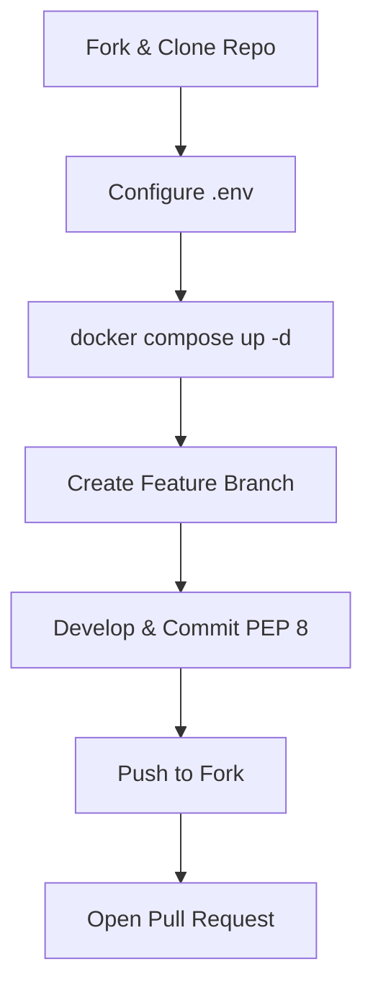
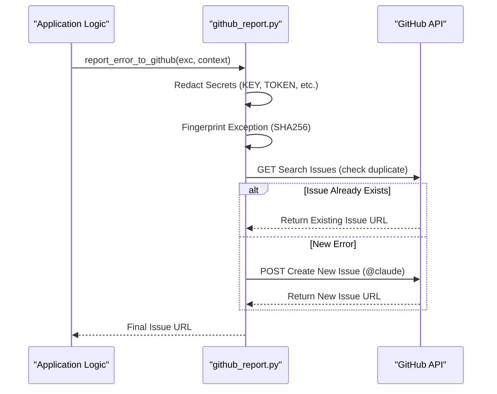

<details>
<summary>Relevant source files</summary>

The following files were used as context for generating this wiki page:

- [CONTRIBUTING.md](CONTRIBUTING.md)
- [SECURITY.md](SECURITY.md)
- [AGENTS.md](AGENTS.md)
- [CLAUDE.md](CLAUDE.md)
- [github_report.py](github_report.py)
- [scraper/scraper.py](scraper/scraper.py)
</details>

# Contributing & Issue Reporting

The Web Scraper platform provides a structured framework for community contributions and robust, automated issue reporting. This page details the procedures for manual bug reporting, the development lifecycle for new features, and the internal architecture of the automated error-reporting system that monitors the production environment.

## Introduction

Contributing to this project involves adhering to specific code standards and utilizing provided templates for reporting bugs or suggesting features. The project utilizes a Docker-based development stack and enforces PEP 8 for Python and ESLint for JavaScript/React. A unique aspect of the project is its integration with automated agents and a "best-effort" error reporting system that sanitizes sensitive data before submitting issues to GitHub.

Sources: [CONTRIBUTING.md:1-5](CONTRIBUTING.md#L1-L5), [CLAUDE.md:1-30](CLAUDE.md#L1-L30)

## Manual Issue Reporting

Users can report issues through standard GitHub templates or confidential security channels.

### Bug Reports and Feature Requests
Standard issues should be reported using the templates located in the `.github/ISSUE_TEMPLATE/` directory. 
- **Bug Reports**: Must include OS version, Docker version, reproduction steps, and logs from `docker logs`.
- **Feature Requests**: Must describe the problem solved, the envisioned use case, and potential alternatives.

Sources: [CONTRIBUTING.md:7-19](CONTRIBUTING.md#L7-L19)

### Security Vulnerabilities
Security vulnerabilities should **never** be reported via public issues. The project mandates the use of GitHub's private reporting feature for confidential disclosures. Responses are typically provided within 48 hours.

Sources: [SECURITY.md:7-15](SECURITY.md#L7-L15)

## Development Lifecycle

The contribution process follows a standard fork-and-pull-request model with strict environment configurations.

### Setup and Submission Flow
The following diagram illustrates the workflow for contributing code to the project:



The flow ensures that developers test changes in a containerized environment mirroring production before submission. 
Sources: [CONTRIBUTING.md:21-43](CONTRIBUTING.md#L21-L43)

### AI Agent Guidelines
The project explicitly defines permissions and restrictions for AI-driven contributions, such as those initiated by Claude.

| Action Category | Allowed | Forbidden |
| :--- | :--- | :--- |
| **Branch Management** | Create branches | Delete branches |
| **Code Operations** | Modify code, Run tests | Push to main/master, Merge PRs |
| **Workflow/Security** | Open PRs | Disable workflows, Modify secrets |

Sources: [AGENTS.md:22-38](AGENTS.md#L22-L38)

## Automated Error Reporting Architecture

The project implements an automated system in `github_report.py` to capture and report unexpected runtime exceptions directly to GitHub as issues.

### The Reporting Flow
When an unhandled exception occurs in the Scraper, API, or WebUI, the system triggers the `report_error_to_github` function. This process includes data sanitization and deduplication.



The diagram shows the logic for preventing issue spamming through fingerprinting and how the `@claude` tag is used to trigger automated remediation workflows.
Sources: [github_report.py:27-100](github_report.py#L27-L100), [CLAUDE.md:28-36](CLAUDE.md#L28-L36)

### Sanitization and Fingerprinting
To protect user privacy and project security, the reporter applies several regex-based masking rules:
- **Secret Masking**: Any environment variable containing `KEY`, `TOKEN`, `SECRET`, or `PASS` has its value replaced with `[REDACTED]`.
- **Pattern Matching**: Automatically masks common formats like `sk-...` (OpenAI), `ghp_...` (GitHub), and `Bearer` tokens.
- **Path Generalization**: Replaces user home directories (`/home/username/`) with `/home/[user]`.
- **Deduplication**: Generates a stable 10-character fingerprint based on the exception type and the file/line number where it was raised to avoid duplicate issues for the same recurring crash.

Sources: [github_report.py:35-65](github_report.py#L35-L65)

### Implementation Example
The Scraper module utilizes Flask error handlers to catch and report unexpected errors during HTTP requests.

```python
@app.errorhandler(Exception)
def handle_unexpected_error(exc):
    from werkzeug.exceptions import HTTPException
    if isinstance(exc, HTTPException):
        return exc
    logger.exception("Unhandled error handling %s %s", request.method, request.path)
    report_error_to_github(
        "blixten85/scraper",
        f"Oväntat fel: {request.method} {request.path}",
        exc,
        context={"method": request.method, "path": request.path},
    )
    return jsonify({"error": "Internal server error"}), 500
```

Sources: [scraper/scraper.py:41-54](scraper/scraper.py#L41-L54)

## Summary

Contributing to the Web Scraper platform requires a balance of manual adherence to standards and interaction with automated systems. While developers follow PEP 8 and a fork-based workflow, the system itself proactively reports its own failures via a sanitized, fingerprint-aware GitHub reporter. This dual approach ensures high code quality and rapid response to production regressions without compromising sensitive credentials.

Sources: [CONTRIBUTING.md:45-56](CONTRIBUTING.md#L45-L56), [github_report.py:1-25](github_report.py#L1-L25)
