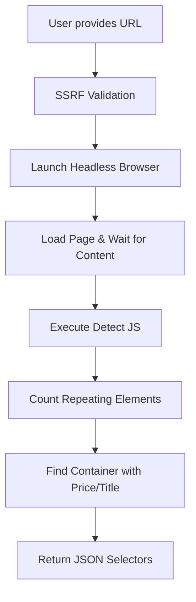
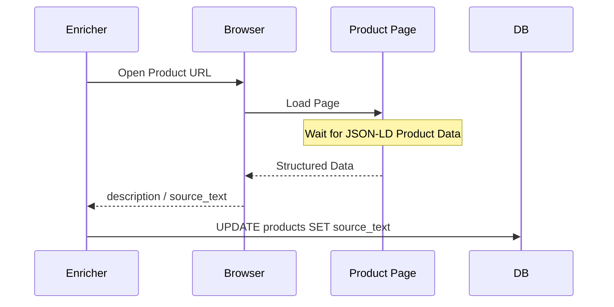
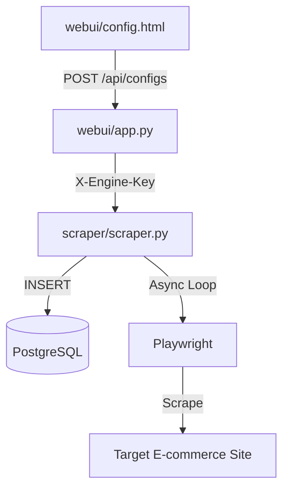

Relevant source files

The following files were used as context for generating this wiki page:

- [scraper/scraper.py](scraper/scraper.py)
- [webui/templates/config.html](webui/templates/config.html)
- [webui/app.py](webui/app.py)
- [README.md](README.md)
- [scraper/enrich.py](scraper/enrich.py)
- [webui/static/script.js](webui/static/script.js)

# Adding New Scraper Targets

The platform is designed to be a multi-site scraper that can target any e-commerce site using CSS selectors. Adding a new target involves defining how the scraper should identify products, extract their titles and prices, and navigate through categories or search results.

Users can add targets manually through the WebUI, utilize built-in templates for popular Swedish retailers, or use the "Auto-detect" feature which employs heuristics to find the correct CSS selectors automatically.

Sources: [README.md:12](README.md#L12), [scraper/scraper.py:213-239](scraper/scraper.py#L213-L239)

## Configuration Data Model

Every scraper target is stored in the `scraper_config` table. This configuration defines the boundaries of the crawl, the specific elements to extract, and the behavior of the headless browser (such as using stealth mode or proxies).

### The Scraper Config Schema

| Field | Type | Description |
|-------|------|-------------|
| `name` | TEXT | Unique identifier for the site (e.g., "Webhallen"). |
| `base_url` | TEXT | The starting URL(s) for the scraper. |
| `product_selector` | TEXT | CSS selector for the container of a single product. |
| `title_selector` | TEXT | CSS selector for the product title within the container. |
| `price_selector` | TEXT | CSS selector for the price (supports regex patterns). |
| `link_selector` | TEXT | CSS selector for the anchor tag leading to the product page. |
| `pagination_type` | TEXT | Either `query` (URL params) or `subcategory` (crawling links). |
| `use_stealth` | INTEGER | Boolean flag (0/1) to enable Playwright-Stealth. |
| `proxy_url` | TEXT | Optional SOCKS5/HTTP proxy for this specific target. |

Sources: [scraper/scraper.py:233-259](scraper/scraper.py#L233-L259), [README.md:158-180](README.md#L158-L180)

## Target Discovery Methods

### 1. Manual Entry
The WebUI provides a form to input specific CSS selectors. The system validates the `base_url` to ensure it uses `http` or `https` and is not pointing to private/internal IP addresses (SSRF protection).

Sources: [scraper/scraper.py:108-129](scraper/scraper.py#L108-L129), [webui/templates/config.html:43-115](webui/templates/config.html#L43-L115)

### 2. Quick Templates
The system includes pre-defined configurations for common sites. These templates populate the form with known-working selectors and settings.

*  **Inet.se**: Uses `subcategory` pagination and follows category links.
*  **Komplett.se**: Requires proxy/stealth due to Akamai protection.
*  **Webhallen.com**: Uses standard product item selectors and subcategory discovery.

Sources: [webui/templates/config.html:200-230](webui/templates/config.html#L200-L230)

### 3. Auto-Detection Heuristics
The `/detect` endpoint uses a Playwright-driven headless browser to analyze a target URL. It executes a JavaScript heuristic script in the page context to identify product containers and their children.

The heuristic logic searches for patterns:
*  **Products**: Elements (like `article`, `li`, `div`) that appear at least 3 times.
*  **Price**: Elements matching regex `/\\d[\\d\\s]*\\s*(kr|SEK|:-|,\\d{2})/i`.
*  **Bot Protection**: Detects scripts from Akamai, Cloudflare, or PerimeterX to suggest enabling Stealth Mode.

Sources: [scraper/scraper.py:850-980](scraper/scraper.py#L850-L980), [webui/app.py:161-167](webui/app.py#L161-L167)

## Advanced Scraping Logic

### Pagination Modes
Targets can be crawled using two primary methods defined in `scraper_config`:

1.  **Query Pagination**: Appends `?page=N` to the `base_url`. This is standard for search results.
2.  **Subcategory Discovery**: The scraper finds links matching a `pagination_selector` (e.g., `a[href*='/kategori/']`) and adds them to a queue to crawl recursively.

Sources: [scraper/scraper.py:539-650](scraper/scraper.py#L539-L650), [webui/templates/config.html:235-245](webui/templates/config.html#L235-L245)

### Product Enrichment
After the initial listing is scraped, the `enrich.py` module can be used to visit individual product pages. This utilizes a `detail_selector` to extract full descriptions or grounded facts from JSON-LD structured data.

Sources: [scraper/enrich.py:73-108](scraper/enrich.py#L73-L108), [scraper/scraper.py:270-280](scraper/scraper.py#L270-L280)

## Implementation Workflow

When a new target is saved, the WebUI proxies the request through `app.py` to the Scraper Engine.

The Scraper Engine validates the incoming JSON and stores it. The `scraper_loop` in `scraper.py` periodically loads these active configurations and spawns worker tasks based on the `concurrent_pages` setting.

Sources: [webui/app.py:130-145](webui/app.py#L130-L145), [scraper/scraper.py:785-815](scraper/scraper.py#L785-L815), [scraper/scraper.py:35-40](scraper/scraper.py#L35-L40)

## Technical Constraints and Security
*  **SSRF Protection**: Hostnames are resolved and checked against private network ranges (10.0.0.0/8, 127.0.0.0/8, etc.) before any request is made.
*  **Stealth Mode**: Uses `playwright_stealth` to bypass bot detection.
*  **Authentication**: All requests to the engine require an `X-Engine-Key` header, while WebUI requests are protected by Basic Auth.

Sources: [scraper/scraper.py:108-129](scraper/scraper.py#L108-L129), [webui/app.py:105-115](webui/app.py#L105-L115), [scraper/scraper.py:820-835](scraper/scraper.py#L820-L835)

The process of adding scraper targets combines flexible CSS-based extraction with automated discovery tools, ensuring that new e-commerce sites can be integrated into the monitoring platform with minimal manual coding.

Sources: [README.md:12-25](README.md#L12-L25), [scraper/scraper.py:1015-1025](scraper/scraper.py#L1015-L1025)
