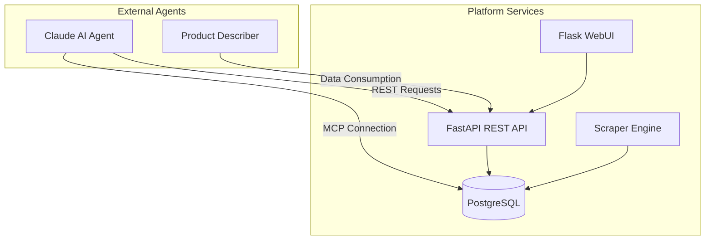
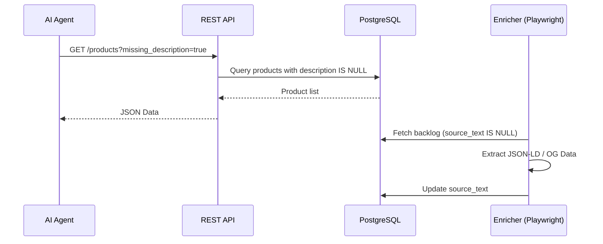

<details>
<summary>Relevant source files</summary>

The following files were used as context for generating this wiki page:

- [AGENTS.md](AGENTS.md)
- [CLAUDE.md](CLAUDE.md)
- [CHANGELOG.md](CHANGELOG.md)
- [scraper/scraper.py](scraper/scraper.py)
- [webui/app.py](webui/app.py)
- [README.md](README.md)
</details>

# AI Agents & Claude Integration

## Introduction
The Web Scraper platform incorporates a specialized integration for AI agents, specifically optimized for the Claude code assistant. The system is designed to expose product data for consumption by external services and AI-driven agents, such as `product-describer`, enabling automated analysis and enrichment of scraped content.

The integration provides a structured environment for agents to interact with the scraper's REST API and PostgreSQL database. It includes automated error reporting mechanisms that tag issues specifically for Claude, ensuring that unexpected exceptions in the API, WebUI, or scraper modules are addressed efficiently.

Sources: [AGENTS.md:1-5](AGENTS.md#L1-L5), [CLAUDE.md:1-5](CLAUDE.md#L1-L5), [CLAUDE.md:43-50](CLAUDE.md#L43-L50)

## Architecture and Interaction Flow
The AI Agent integration operates across the project's multi-service architecture, which consists of a FastAPI REST API, a Flask WebUI, and the Playwright-based scraper engine. Agents typically interact via the REST API or directly through the Model Context Protocol (MCP) by accessing the exposed PostgreSQL port.



The diagram shows the relationship between external AI agents and the internal platform services, highlighting the dual-path access via API and direct database connection for MCP.
Sources: [AGENTS.md:7-20](AGENTS.md#L7-L20), [CLAUDE.md:7-20](CLAUDE.md#L7-L20), [CHANGELOG.md:88-90](CHANGELOG.md#L88-L90)

### Error Reporting System
The platform implements a dedicated error reporting module, `github_report.py`, which is utilized by the API, WebUI, and scraper processes. When an unexpected exception occurs, the system attempts to open a GitHub issue tagged with `@claude`.

*  **Redaction:** The system automatically redacts secrets, emails, and local paths before posting.
*  **Trigger:** Reporting is active only if the `GITHUB_ERROR_REPORT_TOKEN` environment variable is configured.
*  **Automation:** Changes submitted via Claude PRs are configured to auto-rebase and re-trigger CI checks to maintain code quality.

Sources: [CLAUDE.md:43-50](CLAUDE.md#L43-L50), [CHANGELOG.md:108-110](CHANGELOG.md#L108-L110)

## Agent Capabilities and Constraints
To maintain system integrity and security, specific permissions and restrictions are enforced for AI agents and automated contributors.

### Operation Guidelines
| Category | Permissions / Constraints |
| :--- | :--- |
| **Allowed** | Create branches, modify code, run tests, and open Pull Requests. |
| **Forbidden** | Push directly to main/master, merge PRs, delete branches, or modify secrets. |
| **Security** | Secrets must be accessed via environment variables; credentials must never be committed. |
| **Dev Environment** | Support for `uvicorn` (API) and `flask` (WebUI) for local agent development. |

Sources: [AGENTS.md:31-50](AGENTS.md#L31-L50), [CLAUDE.md:22-30](CLAUDE.md#L22-L30)

### Data Enrichment for Agents
The platform includes an `enrich.py` module designed to provide deeper context for AI agents. While the primary scraper collects metadata from listing pages, the enrichment process visits individual product pages to extract `source_text`. This grounded data allows AI agents like the `product-describer` to generate accurate descriptions without hallucination.



The sequence illustrates how the system prepares factual "grounding" data for AI consumption. Note that the API filters on `description IS NULL` (for AI-generated descriptions), while the enricher targets `source_text IS NULL` (for raw product page text).
Sources: [scraper/enrich.py:1-20](scraper/enrich.py#L1-L20), [api/api.py:152-182](api/api.py#L152-L182)

## Technical Configuration
Agents accessing the system must adhere to specific technical requirements and authentication protocols.

### API Access and MCP
For programmatic access, agents must provide an `X-API-Key`. For advanced Claude workflows using the Model Context Protocol (MCP), the PostgreSQL port (5432) is exposed on localhost within the Docker environment.

```python
# Server-side: API Key retrieval for authentication (api/api.py)
def get_api_key():
    global API_KEY
    if API_KEY is None:
        API_KEY = read_secret("API_KEY") or _read_credential("api_key")
    return API_KEY

# FastAPI middleware that validates X-API-Key header on all requests (api/api.py)
@app.middleware("http")
async def check_api_key(request: Request, call_next):
    if request.url.path in ["/health", "/docs", "/openapi.json", "/", "/redoc"]:
        return await call_next(request)
    if request.headers.get("X-API-Key") != get_api_key():
        raise HTTPException(status_code=401, detail="Unauthorized")
    return await call_next(request)

# Agent-side: Making authenticated requests
import requests
api_key = open("/path/to/credentials/api_key").read().strip()
response = requests.get(
    "http://localhost:8000/products",
    headers={"X-API-Key": api_key}
)
```

Sources: [api/api.py:108-128](api/api.py#L108-L128), [webui/app.py:70-75](webui/app.py#L70-L75), [README.md:105-115](README.md#L105-L115)

### Relevant API Endpoints
| Endpoint | Method | Description |
| :--- | :--- | :--- |
| `/products` | GET | Retrieve product list for analysis. |
| `/deals` | GET | Identify price drops for alert generation. |
| `/api/detect` | POST | Auto-detect CSS selectors via Playwright heuristics. |
| `/api/stats` | GET | Monitor platform health and scraping volume. |

Sources: [README.md:118-130](README.md#L118-L130), [webui/app.py:175-200](webui/app.py#L175-L200)

## Summary
The AI Agents & Claude Integration provides a robust framework for automated data extraction and analysis. By combining secure REST API access, direct database connectivity for MCP, and a specialized `@claude` error reporting mechanism, the platform ensures that AI agents have the necessary factual grounding and operational support to perform complex e-commerce data tasks effectively.
