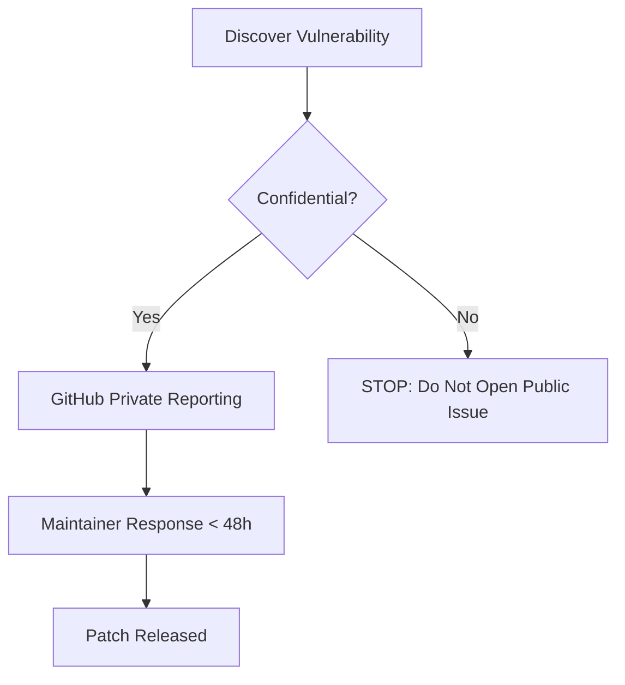
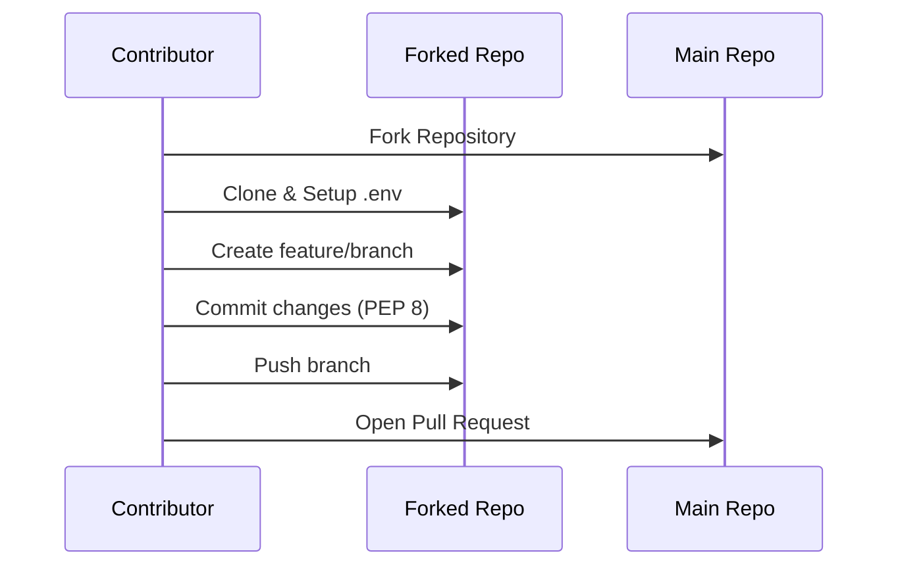

Relevant source files

The following files were used as context for generating this wiki page:

- [CONTRIBUTING.md](CONTRIBUTING.md)
- [SECURITY.md](SECURITY.md)
- [AGENTS.md](AGENTS.md)
- [CLAUDE.md](CLAUDE.md)
- [scraper/scraper.py](scraper/scraper.py)
- [webui/app.py](webui/app.py)

# Contributing & Issue Reporting

The Web Scraper Platform provides a structured framework for community contributions and vulnerability reporting. This system ensures that code changes follow established standards, security disclosures remain confidential until patched, and automated error reporting assists developers in maintaining system stability.

This page outlines the protocols for reporting bugs, suggesting features, submitting code via Pull Requests, and the specialized automated error reporting mechanism integrated into the software's execution.

## 🐛 Bug Reporting and Feature Requests

The project utilizes GitHub Issue templates to ensure high-quality reports. For bugs, contributors must provide environmental context and reproduction steps. For features, the focus is on the problem solved and the envisioned use case.

### Reporting Guidelines
| Report Type | Required Information |
| :--- | :--- |
| **Bug Report** | OS version, Docker version, reproduction steps, expected vs. actual behavior, and `docker logs` output. |
| **Feature Request** | Feature description, problem statement, envisioned usage, and considered alternatives. |

Sources: [CONTRIBUTING.md:5-18](CONTRIBUTING.md#L5-L18)

## 🛡️ Security Vulnerability Reporting

The project maintains a strict "no public issue" policy for security vulnerabilities. Instead, researchers are directed to use GitHub's private reporting feature to ensure confidential disclosure.

### Vulnerability Disclosure Flow

The project team commits to responding to private reports within 48 hours and releasing patches as quickly as possible upon confirmation.

Sources: [SECURITY.md:7-15](SECURITY.md#L7-L15)

## 🛠️ Automated Error Reporting (GitHub Integration)

A unique feature of this platform is the `report_error_to_github` function found across multiple modules. When unexpected exceptions occur in the API, WebUI, Scraper, or Alerts modules, the system attempts to open a GitHub issue automatically.

### Error Reporting Logic
- **Scope**: Covers unexpected exceptions in `api/`, `webui/`, `scraper/`, and `alerts/`.
- **Anonymization**: Secrets, emails, and local file paths are redacted before submission.
- **Tagging**: Issues are automatically tagged with `@claude`.
- **Requirement**: This feature is only active if the `GITHUB_ERROR_REPORT_TOKEN` environment variable is set.

Sources: [CLAUDE.md:27-33](CLAUDE.md#L27-L33), [scraper/scraper.py:27-38](scraper/scraper.py#L27-L38), [webui/app.py:44-55](webui/app.py#L44-L55)

## 📥 Development and Pull Requests

Contributors are expected to follow a specific workflow involving forking, environment configuration, and branch-based development.

### Development Workflow

### Technical Standards
- **Python**: Must adhere to PEP 8 style guides.
- **JavaScript**: Must comply with the provided ESLint configuration.
- **Documentation**: Complex logic and public functions must be commented.
- **Commits**: Messages must be clear and descriptive.

Sources: [CONTRIBUTING.md:21-51](CONTRIBUTING.md#L21-L51)

## 🤖 AI Agent Guidelines

For AI agents (like Claude Code) contributing to the repository, a specific set of allowed and forbidden actions is enforced to maintain repository integrity.

### Agent Permission Model
| Allowed Actions | Forbidden Actions |
| :--- | :--- |
| Create branches | Push directly to main/master |
| Modify code | Merge Pull Requests |
| Run tests | Delete branches |
| Open Pull Requests | Disable workflows or modify secrets |

Sources: [AGENTS.md:21-34](AGENTS.md#L21-L34)

## 🐳 Docker and Environment Conventions

The project relies heavily on Docker Compose. Development setup requires copying `.env.example` to `.env` and starting the stack via `docker compose up -d`.

### Image Standards
- Use multi-stage builds where appropriate to keep images small.
- Follow Dockerfile best practices.
- Verify builds using `docker compose build`.

Sources: [CONTRIBUTING.md:53-57](CONTRIBUTING.md#L53-L57), [CLAUDE.md:24-25](CLAUDE.md#L24-L25)

The contributing and reporting infrastructure is designed to bridge the gap between manual community efforts and automated system health monitoring, ensuring the platform remains production-ready and secure.
